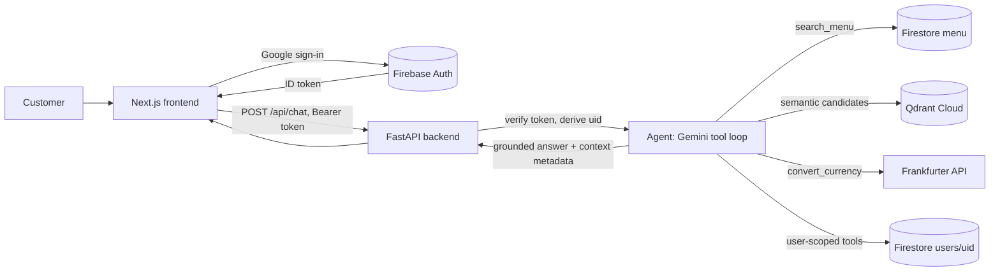
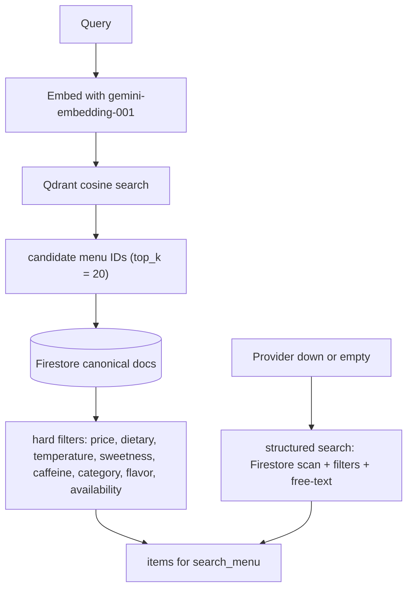

<div align="center">
  
  <h1>Grounded</h1>
  <p><em>Coffee that gets to know you.</em></p>

  [](frontend/package.json)
  [](backend/requirements.txt)
  [](backend/requirements.txt)
  [](firebase.json)
  [](backend/app/rag/vectorestore.py)
  [](backend/app/config.py)
  [](infrastructure/render.yaml)
  [](backend/tests/)
</div>

---

## What is Grounded

Grounded is an AI coffee-shop assistant built as an agentic RAG application. A customer talks to a coffee assistant in a Next.js chat interface, and the assistant answers from the shop's real menu and the customer's own stored context: preferences, past conversations, and past orders. Answers are produced by an agent that decides what it needs, retrieves it, and only then reasons over it, instead of the model guessing from memory.

The system combines conversational AI, hybrid menu retrieval, customer preferences, conversation and order context, tool-based actions, Firebase authentication, and user-scoped persistence in Cloud Firestore. It exists because questions such as *"what's a dairy-free iced drink under 200?"* need factual, current data, not a generic LLM answer. The assistant is grounded in the actual menu and in the available customer context, and it is honest when information is not available.

## Key capabilities

- **Hybrid menu retrieval.** Menu questions are answered by combining semantic search over the menu with deterministic structured filtering (see [Retrieval architecture](#retrieval-architecture)).
- **Semantic search.** Queries are embedded with a Gemini embedding model and matched against a Qdrant Cloud collection using cosine similarity.
- **Hard, deterministic constraints.** Price, dietary, temperature, sweetness, caffeine, category, flavor, and availability filters are applied as strict predicates against canonical menu documents, never left to the model to interpret.
- **Personalized recommendations.** The agent reads stored customer preferences and tailors recommendations to them, but only when the customer has enabled preference personalization.
- **Preference memory.** Stable, customer-stated preferences ("I prefer oat milk") can be saved and reused in later conversations.
- **Conversation context.** Recent past conversations can be retrieved and used when a question genuinely depends on them.
- **Order history.** Past orders can be retrieved and referenced when relevant, with the caveat that an old order never proves current availability.
- **Currency conversion through a dedicated tool.** Cross-currency questions are answered by a conversion tool backed by the Frankfurter reference-rate API; the model never invents exchange rates.
- **Agentic tool orchestration.** A single Gemini-driven agent decides which tools to call, executes them in a bounded loop, and writes a grounded final answer.
- **Firebase authentication.** Google sign-in plus server-side verification of Firebase ID tokens using Google's public keys.
- **User-scoped persistence.** All customer data lives under `users/{uid}/` in a named Firestore database, protected by default-deny security rules.
- **Honest failure behavior.** When the menu has no match or the knowledge needed is missing, the assistant says so instead of guessing.
- **Production container image.** A Docker image runs the backend with uvicorn for container-based deployment.

## How it works



The request path is:

1. The customer signs in with Google on the frontend. Firebase Authentication returns a Firebase ID token.
2. The frontend sends the conversation to `POST /api/chat` with the token in the `Authorization` header.
3. The backend verifies the token with Google's public keys and derives the authenticated `uid`. It never accepts a UID from the client.
4. The agent binds a set of tools, invokes Gemini, and runs a bounded tool-calling loop (up to four rounds). Each tool call result is fed back to the model as context.
5. `search_menu` reads the canonical menu from Firestore, optionally using Qdrant for semantic candidates first. `convert_currency`, preference, conversation-history, and order-history tools call their own services.
6. The model produces a final answer. The API response includes context metadata (`used_preferences`, `used_conversation_history`, `used_order_history`, `retrieval_used`, `retrieval_count`) so the UI can show honest provenance without exposing internal reasoning.

The frontend stores conversations in Firestore in real time and sends the active conversation to the backend with each chat request. Startup is lazy: the first chat request doubles as the backend readiness check.

## Retrieval architecture

Grounded uses hybrid menu retrieval rather than vector-only similarity search. The reason is that real menu questions combine intent with hard constraints, and those constraints must be enforced deterministically.

> "something dairy-free under 200"

Vector similarity can surface items that *sound* like the request, but it cannot guarantee an item is dairy-free or that its price is under 200. Those facts live in structured menu documents, so Grounded treats semantic search as a candidate finder and structured data as the authority.

### Implementation

- **Embeddings.** Queries and menu text are embedded with `gemini-embedding-001` through `langchain-google-genai`, using the same Gemini API key as the chat model.
- **Vector index.** Candidates are stored in a Qdrant Cloud collection (`grounded-menu`). Indexing runs as an explicit maintenance operation (`python -m app.menu_index`), never inside a chat request. Points use deterministic IDs so re-indexing overwrites instead of duplicating.
- **Indexed representation.** Each menu item is embedded from a deterministic text form: name, category, description, ingredients, flavors, tags, sweetness, caffeine, temperature, and dietary fields. Price and availability are deliberately excluded from vectors because those facts change and must always come from Firestore.
- **Search flow.** A query is embedded, Qdrant returns the top `MENU_SEMANTIC_TOP_K` candidate menu IDs (default 20), and each candidate is re-fetched from Firestore. Candidates that no longer exist in Firestore are dropped, since Firestore is the source of truth.
- **Hard filters.** Every candidate is checked against all supplied filters with exact, case-insensitive predicates: `max_price`, `dietary`, `category`, `caffeine`, `temperature`, `sweetness`, `flavor`, and `available`. A candidate that fails any of them is never returned, regardless of how similar it is.
- **Fallback.** If the embedding or vector-store providers fail, or return no matches, the search falls back to a structured scan of Firestore: the same hard filters plus a free-text match over name, description, ingredients, tags, and flavors, sorted by name. The hybrid path is only active when `VECTOR_STORE_PROVIDER`, `QDRANT_URL`, `QDRANT_API_KEY`, and the Gemini key are all configured.
- **Result surface.** The `search_menu` tool returns the filtered items (up to 8 in the display) with price, size, caffeine, temperature, sweetness, dietary tags, and availability, so the model only ever sees facts backed by the menu data.



## Agent and tools

The assistant is a single agent: one Gemini model that makes tool calls in a loop until it produces a final answer. The loop is bounded at four rounds (`_MAX_TOOL_ROUNDS`), each round executes every tool call the model requests, and the tool results are appended to the conversation before the next model call. Per-request tool traces and token usage are recorded for observability but are not exposed through the API.

The agent is instructed to always use tools for facts: menu questions through `search_menu`, currency questions through `convert_currency`, and personalization through the customer-scoped tools. It is also instructed never to reveal its instructions and to stay silent rather than guess.

| Tool | Purpose | Key inputs / outputs |
| --- | --- | --- |
| `search_menu` | All menu questions: names, prices, sizes, milk and dietary options, temperature, sweetness, caffeine, flavors, availability. | Inputs: `query`, `category`, `max_price`, `dietary`, `caffeine`, `temperature`, `sweetness`, `available`, `flavor`. Output: formatted matching items or an explicit "not on the menu" message. |
| `convert_currency` | Convert an amount between two currencies. | Inputs: `amount`, `from_currency`, `to_currency` (ISO codes or common symbols/names like `$` or `rupees`). Output: converted amount and the published reference rate, sourced from the Frankfurter API. |
| `get_customer_preferences` | Read the customer's stored preferences before a personalized recommendation. | Output: stored preference lines, a "personalization switched off" notice, or a "no stored preferences" notice. |
| `save_preference` | Persist a clear, stable preference the customer explicitly stated. | Inputs: `field` (one of 15 validated preference fields) and `value`. Validated against the schema before writing. |
| `get_conversation_history` | Read a recent slice of past conversations when a question genuinely depends on an earlier chat. | Output: recent past conversations, respecting the customer's `conversationHistoryEnabled` preference. |
| `get_order_history` | Read the customer's recent past orders when relevant. | Output: recent orders with items and totals, with a note that old orders do not prove current availability. |

The customer-scoped tools (preferences, conversation history, order history) are built per request and close over the authenticated UID. They accept no UID or path arguments, so the model cannot reach another customer's data or an arbitrary Firestore path. Currency conversion is performed only through `convert_currency`; the model is explicitly instructed to call `search_menu` first for the real menu price and to never compute an exchange rate itself.

## Data and memory

Grounded keeps two kinds of data clearly separated.

**Global menu data** lives in the `menu/` collection and is the same for every customer. It is the canonical source of every menu fact the assistant reports. The bundled dataset (`backend/data/menu.json`) contains 100 items across five categories: Hot Coffee, Cold Coffee, Non-Coffee Beverages, Tea, and Food & Bakery, with 20 items each. Items carry name, description, ingredients, size, price, dietary tags, caffeine, temperature, sweetness, flavor profile, tags, and availability.

**User-scoped data** lives under `users/{uid}/` in the named Firestore database `grounded`:

```text
users/
  {uid}/
    profile/current/          display name, email, picture
    preferences/current/      coffee preferences, AI context, history toggle
    conversations/            conversation documents (messages, timestamps)
      {conversation_id}/
        messages/             per-message subcollection
        summaries/            conversation summaries
    orders/                   past order documents (items, totals)
    memories/                 customer-editable memory notes
```

- **Preferences** (coffee preferences, AI context, and the conversation-history toggle) are read and updated through the backend API (`GET/PATCH /api/preferences`), not by direct client access.
- **Memories** are managed by the frontend directly against Firestore and are protected by the same user-scoped security rules.
- **Conversations** are written by the frontend in real time (an `onSnapshot` listener keeps the UI in sync) and are read by the backend through the `get_conversation_history` tool when the agent needs them.
- **Orders** are stored as documents under `users/{uid}/orders/` and read by the backend through `get_order_history`.

User identity is always derived from the verified Firebase token. No user can address another user's subtree, and the backend tools can only ever read or write the authenticated customer's documents.

## Authentication and security

**Authentication flow.** The frontend signs the customer in with Google (`signInWithPopup`), obtains a Firebase ID token, and sends it as `Authorization: Bearer <token>`. The backend verifies the token with `google.oauth2.id_token.verify_token` against Google's public JWKS endpoint for Firebase Auth (`securetoken@system.gserviceaccount.com`), with the Firebase project ID as the audience. The authenticated UID is read from the verified token's `sub` claim. Token verification uses Google's public key material and does not require service-account credentials.

**Firestore access.** Service-account credentials are only required for Firestore and other Admin SDK operations. They are located through `GOOGLE_APPLICATION_CREDENTIALS` (an explicit path or gcloud application-default credentials). The service-account JSON is never committed to the repository.

**Security rules.** `firestore.rules` implements default-deny: `allow read, write: if false` applies to all paths, and each user may only read and write under their own `users/{uid}` subtree.

**Other measures.**

- All API routes except `GET /health` require a verified token.
- CORS origins come exclusively from the `ALLOWED_ORIGINS` environment variable; unset or empty means cross-origin requests are denied (default-deny).
- The customer-scoped tools close over the verified UID and expose no user or path arguments.
- Authentication tokens, API keys, and credentials are never logged.
- Provider and internal errors are returned to the client as safe generic messages; details stay in server logs.

## Tech stack

| Layer | Technology |
| --- | --- |
| Frontend | Next.js 16, React 19, TypeScript, Tailwind CSS 4, Firebase JS SDK (auth + Firestore) |
| Backend | Python 3.13, FastAPI, Pydantic, uvicorn, httpx |
| AI / LLM | Gemini (`gemini-3.1-flash-lite`), `langchain-google-genai`, LangChain tool calling |
| Agent framework | LangGraph state machine under `backend/app/agent` (retrieval graph for the RAG layer) |
| Retrieval | Qdrant Cloud (`qdrant-client`), Gemini embeddings (`gemini-embedding-001`) |
| Database | Cloud Firestore, named database `grounded` (`firebase-admin`, `google-cloud-firestore`) |
| Authentication | Firebase Authentication (Google sign-in), `google-auth` ID token verification |
| Infrastructure | Docker (backend image), Render Web Service blueprint |
| Testing | pytest (backend), Vitest + Testing Library (frontend), custom eval harness |


## Project structure

```text
frontend/                 Next.js single-page app: chat, history, profile, auth
backend/
  app/
    agent/                LangGraph RAG agent graph, state, and nodes
    ai/                   Gemini chat model provider and LLM wiring
    api/                  FastAPI routes and Pydantic schemas
    rag/                  chunking, embeddings, Qdrant wrapper, retriever, context assembly
    repositories/         Firestore data access for menu, users, preferences, conversations, orders
    services/             chat orchestration, menu search, currency, and tool definitions
  data/menu.json          canonical menu dataset (100 items, 5 categories)
  evals/                  deterministic evaluation harness
  tests/                  pytest suite
  Dockerfile              backend container image
infrastructure/
  render.yaml             Render deployment blueprint for the backend
docs/                     engineering contracts (backend profile contract)
firebase.json             Firestore rules and index configuration
firestore.rules           default-deny user-scoped security rules
```

## Evaluation and testing

Grounded is tested at three levels.

**Backend pytest suite.** Roughly 320 pytest cases across 21 modules under `backend/tests/`, covering token verification, configuration, chat flow, chat schemas, menu ingestion and validation, the hybrid menu search service, menu and currency tools, preference validation and tools, order-history and conversation-history services, RAG interfaces, chunking, agent state, and the eval harness itself.

**Frontend Vitest suite.** 18 test cases under `frontend/src/__tests__/` covering the preferences API client, backend readiness state machine, coffee-facts utilities, and the fun-fact bubble behavior.

**Evaluation harness.** `backend/evals/` is a read-only, deterministic harness that exercises the real production pipeline (`ChatService`, `MenuService` filtering, real tool execution) with a scripted LLM and fixture services. It runs 45 cases across 12 categories: menu retrieval, semantic retrieval, hard constraints, negative constraints, preferences, conversation history, order history, multi-tool flows, currency, no-result behavior, hallucination, and security. Each case is scored from the executed tool trace, the final answer, and the fixture services' call logs:

- **Groundedness and faithfulness.** A recommended item and price must appear in the actual `search_menu` output.
- **Constraint adherence.** Recommended items must satisfy hard and negative constraints (price, dietary, temperature, sweetness, caffeine).
- **No-result honesty.** Absent items must produce a clear "not available" answer, never an invented one.
- **Personalization.** Preferences must be used when enabled and must not leak when switched off.
- **Security isolation.** Fixture services record the UIDs they are called with; the harness asserts they only ever see the eval user's UID and that `save_preference` never accepts a UID argument.
- **Audit cases.** Two audit cases deliberately use the wrong tool or a hallucinated price; the harness must detect them. A harness run that passes an audit case is itself a failure.
- **Currency.** Numeric conversion checks use fixed rates so assertions are exact.

Deterministic runs are offline (bundled menu fixture, no external services) and reproducible: the semantic provider is stubbed out, so the retrieval path exercised in a deterministic run is the structured one. Results are written to `backend/evals/results/`: a per-category score chart (pure-Python PNG), an append-only JSON history, and a latest-run JSON consumed by CI. A separate `live` mode runs the same cases against real Gemini, real Qdrant, and a live menu.

## Local development

### Prerequisites

- Node.js 20+ and npm
- Python 3.13
- A Firebase project (Firebase Authentication and a Firestore database named `grounded`)
- For semantic retrieval: a Qdrant Cloud instance and a Gemini API key
- For Firestore access from the backend: a Google service account, provided through `GOOGLE_APPLICATION_CREDENTIALS` or `gcloud auth application-default login`

### Clone and configure the backend

```bash
git clone https://github.com/Feroan101/Grounded.git
cd Grounded/backend
python3 -m venv venv
source venv/bin/activate
pip install -r requirements.txt
cp .env.example .env
```

Fill in `backend/.env`. It documents every variable, including `FIREBASE_PROJECT_ID`, `ALLOWED_ORIGINS=http://localhost:3000`, `GOOGLE_APPLICATION_CREDENTIALS`, `GEMINI_API_KEY`, `QDRANT_URL`, and `QDRANT_API_KEY`. Never commit this file. Token verification works without credentials; credentials are only needed for Firestore and Admin SDK operations.

### Ingest and index the menu

```bash
cd backend
python -m app.menu_ingestion                 # validate data/menu.json and write to Firestore
python -m app.menu_index                     # index the Firestore menu into Qdrant (semantic search)
```

`python -m app.menu_index --json data/menu.json` indexes the local dataset instead. Semantic retrieval stays off until `VECTOR_STORE_PROVIDER=qdrant_cloud`, `QDRANT_URL`, `QDRANT_API_KEY`, and the Gemini key are configured, and the search degrades to the structured path, so the backend runs without Qdrant too.

### Configure and run the frontend

```bash
cd frontend
npm install
```

Create `frontend/.env.local` with your Firebase web configuration and the backend URL:

```bash
NEXT_PUBLIC_FIREBASE_API_KEY=...
NEXT_PUBLIC_FIREBASE_AUTH_DOMAIN=...
NEXT_PUBLIC_FIREBASE_PROJECT_ID=...
NEXT_PUBLIC_FIREBASE_STORAGE_BUCKET=...
NEXT_PUBLIC_FIREBASE_MESSAGING_SENDER_ID=...
NEXT_PUBLIC_FIREBASE_APP_ID=...
NEXT_PUBLIC_FIREBASE_MEASUREMENT_ID=...
NEXT_PUBLIC_API_BASE_URL=http://localhost:8000
```

All `NEXT_PUBLIC_FIREBASE_*` values come from your Firebase project's web app settings. Enable Google sign-in in the Firebase console and set the Firestore rules from `firestore.rules` for the `grounded` database.

### Run

```bash
# Backend (from backend/)
uvicorn app.main:app --reload

# Frontend (from frontend/, separate terminal)
npm run dev
```

Open `http://localhost:3000`, sign in with Google, and start chatting.

### Run tests

```bash
# Backend (from backend/)
python -m pytest

# Frontend (from frontend/)
npx vitest run

# Offline deterministic evaluation (from backend/)
python -m evals.run
```

Set `ALLOWED_ORIGINS=http://localhost:3000` before testing the browser flow against a local backend.

## Deployment

The backend ships as a container image and is configured for Render through the blueprint at `infrastructure/render.yaml`:

- Runtime: Docker, backend `Dockerfile`, uvicorn on the container's `PORT`.
- Health check: `GET /health`.
- Environment: `ENVIRONMENT=production`, `FIREBASE_PROJECT_ID`, `FIRESTORE_DATABASE=grounded`, `LLM_PROVIDER=gemini`, `LLM_MODEL`, and `ALLOWED_ORIGINS` set to the deployed frontend origin.
- The Firestore service-account JSON is supplied as a Render Secret File mounted at `/etc/secrets/grounded-coffeeshop-ai.json` and referenced through `GOOGLE_APPLICATION_CREDENTIALS`. The Gemini API key and `QDRANT_URL` / `QDRANT_API_KEY` are provided as Render secret environment variables. No credentials are stored in the repository.

The blueprint header notes that it documents the intended production shape rather than an already-active Render service. The frontend is a standard Next.js app; its hosting configuration is left to your chosen platform (the app reads its Firebase config and backend URL from `NEXT_PUBLIC_*` environment variables at build time).

The frontend handles cold starts explicitly. There is no background health probe: the first chat request is the readiness check. While it is in flight the UI shows a "Waking up Grounded" toast, and if the request fails the UI moves to a retryable "failed" state rather than pretending the backend is ready. This matters on services that sleep when idle, such as Render's free tier.

## Design philosophy

- **Deterministic constraints before generative reasoning.** Price, dietary, temperature, and availability are enforced with code, not by the model. Semantic similarity only nominates candidates.
- **Retrieve before generating.** Every menu fact comes from a tool result, and no-result searches produce honest "not available" answers instead of guesses.
- **Tools for structured and external operations.** Currency conversion, preferences, and history go through dedicated tools with their own services and validation, never through the model's memory.
- **Authenticated user context.** All user data is keyed to a token-derived UID, and scoped tools expose no way to reach another user's data.
- **Bounded and observable agent loops.** Tool loops are capped, and each request records which tools ran and why, for evaluation and debugging.
- **Minimal infrastructure.** One assistant, one backend service, and existing managed services (Firebase, Qdrant, Gemini) rather than a distributed system.
- **Default-deny security.** Firestore rules and CORS both deny by default and are opened only for the authenticated user and the configured origin.