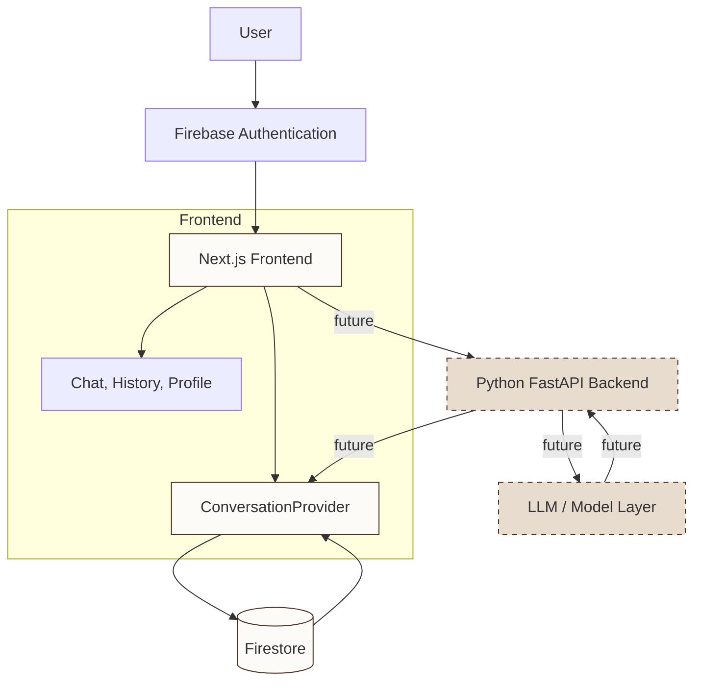

<div align="center">
  <table>
    <tr>
      <td></td>
      <td><h1 style="margin:0; padding-left:12px;">Grounded</h1></td>
    </tr>
  </table>
  <p><em>Coffee that gets to know you.</em></p>
</div>

---

Grounded is a coffee-shop inspired AI assistant. It is designed around the idea that talking to an AI should feel less like using a dashboard and more like sitting down at your regular cafe table: familiar, warm, and personal.

## How it works



When a user signs in, Firebase Authentication establishes their identity via Google OAuth. The resulting Firebase UID becomes the boundary for all user-scoped data.

On load, `ConversationProvider` subscribes to the user's conversations in Firestore using an `onSnapshot` listener. Conversations appear in the UI as soon as they exist, with no manual refresh required.

When a conversation is created, it is written to Firestore immediately. When a message is sent, React state updates instantly for responsive UI, and the full conversation is persisted to Firestore once the response arrives.

When the browser refreshes, the `onSnapshot` listener rehydrates the conversation state from Firestore. The user picks up exactly where they left off.

Deletion removes the document from Firestore and clears it from React state simultaneously.

## AI architecture

### Request flow

```text
User message
    |
    v
Grounded frontend (React state)
    |
    v
ConversationProvider (Firestore write)
    |
    v
Assistant response (currently simulated)
    |
    v
React state + Firestore persistence
```

Currently, the frontend handles the chat experience end-to-end. When a user sends a message, it is added to React state immediately. A simulated assistant response is generated after a short delay. Both the user message and the assistant response are persisted to Firestore directly from the client.

### AI backend

A Python/FastAPI backend exists in the repository with Firebase ID token verification, CORS configuration, and a repository layer covering users, menu items, conversations, and orders. The backend currently exposes a health check and a user profile endpoint.

The backend is designed to become the boundary between the frontend and the model layer. When the AI integration is wired up, the frontend will send messages to the backend, the backend will call the model, and the response will flow back through the same path. The repository layer already contains the data access functions that would support this flow.

### Model layer

The AGENTS.md specification calls for Gemini as the model provider, with Google ADK for agent orchestration. None of this has been implemented yet. The current codebase contains zero AI SDK imports, zero model calls, zero prompt definitions, and zero tool registrations.

When the model layer is added, the backend will accept chat messages, pass them to the model along with relevant context, and return the assistant response. The exact model provider, SDK, and configuration are not locked in. The architecture is designed so that the model layer can be swapped without changing the frontend or the conversation persistence system.

### Conversation context

The frontend sends the full conversation history (user and assistant messages) as part of the conversation document in Firestore. When the model layer is connected, the backend will receive the conversation messages from the frontend and pass them to the model as context.

Currently, the frontend and the backend define different internal data models for conversations. The frontend stores messages as an embedded array in a single document. The backend repository uses a subcollection model. This divergence will need to be resolved when the two layers are connected.

### Why the AI layer is replaceable

Grounded keeps the AI integration behind a backend boundary. The frontend manages conversation state and UI. The backend manages model interaction. Neither is tightly coupled to the internals of the other.

This separation means the model provider can change without rewriting the conversation experience. The current plan is Gemini, but the architecture supports moving to a different provider, a different SDK, or a different inference backend without requiring changes to the chat interface, authentication, Firestore persistence, or the conversation data model.

```text
UI / conversation experience
            |
            v
       AI backend
            |
            v
        Model layer
```

The model layer is a replaceable component behind a stable interface, not a permanent architectural dependency.

## Data architecture

Grounded uses a named Firestore database called `grounded`.

```text
users/
  {uid}/
    conversations/
      {conversationId}/
        title        string
        messages     array of { role, content }
        createdAt    timestamp
```

- `{uid}` is the authenticated Firebase user's UID. Never hardcoded, always sourced from `useAuth()`.
- `{conversationId}` is generated by the application on conversation creation.
- `messages` is the full conversation history as `{ role: "user" | "assistant", content: string }[]`.
- `createdAt` is a Firestore server timestamp, used for chronological ordering.

Firestore security rules default-deny all access. Each user can only read and write their own `users/{uid}/` subtree. No user can access another user's conversations, preferences, or orders.

## Authentication & persistence

Firebase Authentication and Firestore serve complementary roles:

- **Firebase Authentication** handles identity. Google sign-in, session management, and ID token issuance.
- **Firestore** handles persistence. Per-user conversation storage with real-time synchronization.

React state (`ConversationProvider`) acts as the live UI cache: fast, synchronous, scoped to the current session. Firestore is the durable source of truth: persistent, synced across clients, surviving page reloads.

The two layers are kept in sync via optimistic updates (UI responds instantly) and Firestore writes (durability). Errors in Firestore operations are caught and logged without crashing the application.

## Interface

Grounded has three views behind authentication:

- **Chat** is the primary experience. Users talk to the coffee assistant in a clean, conversational interface. Recommendations appear in-context. The chat area uses warm cream tones with coffee brown accents.
- **History** shows past conversations, grouped by date. Conversations can be renamed or deleted. Selecting a conversation returns to the chat.
- **Profile** displays the user's name and email. The display name can be customized and persisted locally.

The interface is designed to feel like a real coffee shop product, not a developer tool or an AI dashboard.

## The name

The name is a double meaning. Grounded as in coffee beans. Grounded as in being present.

## The logo

The logo is a black cat sitting inside a coffee cup, drawn in a clean, minimal line style. It combines two things that feel right together: cats and coffee. The cat has a calm, slightly smug expression, which felt appropriate for a coffee-shop assistant that knows your preferences.

## Technology

| Layer          | Technology                                          |
| -------------- | --------------------------------------------------- |
| Frontend       | Next.js 16, React 19, TypeScript, Tailwind CSS 4   |
| Authentication | Firebase Authentication (Google sign-in)            |
| Database       | Cloud Firestore (named database: `grounded`)        |
| Backend        | Python, FastAPI, Firebase Admin SDK                  |
| Styling        | Tailwind CSS, custom CSS design tokens              |
| Font           | DM Sans                                             |

## Architecture philosophy

Grounded is built around a few deliberate choices:

- **User-scoped data**: every piece of persistent data lives under `users/{uid}/`. No shared collections, no public reads. The Firebase UID is the access boundary.
- **State vs. persistence**: React state handles the live UI. Firestore handles durability. Neither pretends to be the other.
- **Real-time sync**: `onSnapshot` keeps the UI synchronized with Firestore without manual refresh logic.
- **Minimal surface**: the interface shows only what is needed: chat, history, profile. No dashboards, no analytics panels, no unnecessary chrome.
- **Replaceable AI layer**: the model provider sits behind a backend boundary. The conversation experience does not depend on which model is running.
